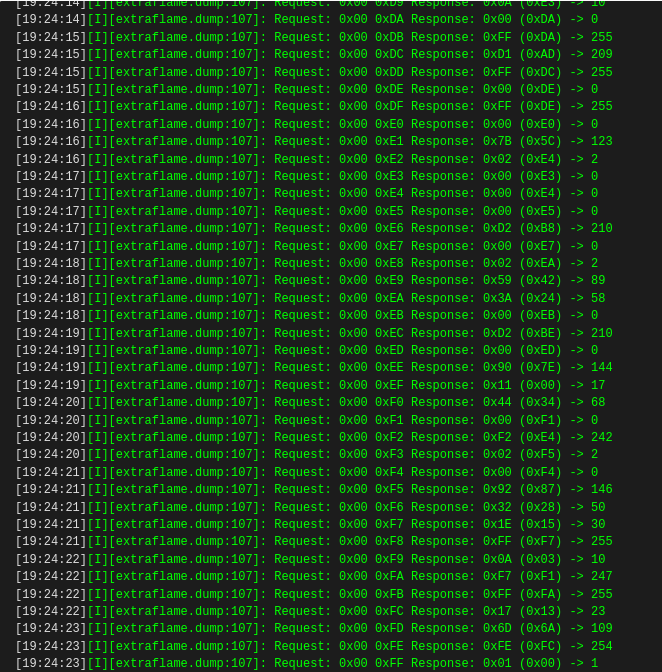

# EspHome-Extraflame

Custom component for EspHome to control your extraflame oven

## 1. Installation

Create the folder `custom_components` (where the `config.yaml` is stored) if it is missing.
Clone this repository with the comment below:

```bash
git clone https://github.com/edenhaus/esphome-extraflame.git extraflame
```

## 2. Base Configuration

The base configuration is needed for all other components to work.
Copy the configuration below into your configuration file. For further options of uart please refer to the [docs](https://esphome.io/components/uart.html)

```yaml
uart:
  baud_rate: 1200
  # data_bits: 8
  # parity: NONE
  stop_bits: 2

extraflame:
```

| Name   |   Type    | Default | Description      |
| ------ | :-------: | ------- | ---------------- |
| `dump` | `boolean` | false   | See dump section |

### 2.1. Sensor

With a sensor it is possible to read any value from the RAM or EEPROM. It will be reported as decimal number.
The addresses seem to be different for different boards. A reference can be found [here](https://k3a.me/ir-controller-for-pellet-stove-with-micronova-controller-stufe-e-pellet-aria-ir-telecomando/)

Typical example of using this sensor would look like this:

```yaml
sensor:
  - platform: extraflame
    memory: RAM
    address: 0x01
```

Here is what every options means:

| Name       |      Type       | Default      | Description                 |
| ---------- | :-------------: | ------------ | --------------------------- |
| `platform` | `static string` | **Required** | `extraflame`                |
| `memory`   |    `string`     | **Required** | `RAM` or `EEPROM`           |
| `address`  |  `hex number`   | **Required** | The address as a hex number |

You can use in addition all [sensor options](https://esphome.io/components/sensor/index.html).
As for example the temperature must be divided by 2, below an complete example, where I use the built in filters.

```yaml
sensor:
  - platform: extraflame
    memory: RAM
    address: 0x01
    name: ${name} Temperatur
    filters:
      - multiply: 0.5
```

## 3. Dump

If you enable the `dump` option, a new home assistant is created with give the possibility to dump all values from the two memories.
The values are logged on level info. Therefore you need be connected to the device to get it.
The main purpose for this functionality is that different oven store the data on different addresses. It should be only activated for debugging or configuration.

Here an example, how to call the service in home assistant:

```yaml
service: esphome.esp13_dump_memory
data:
  memory: RAM # or EEPROM
```

The output should be than something similar to:


## 4. Roadmap

The next step is to support writes changes to the oven.
This component is at an early stage so please be aware that there can be bugs...

## 5. Author & License

Robert Resch, MIT, 2021
