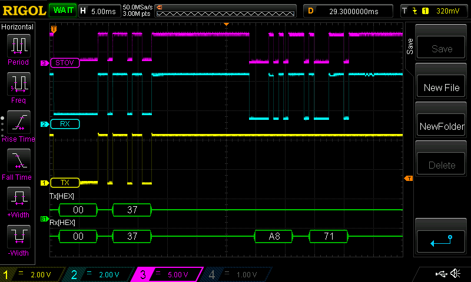

# Extraflame connection

## Finding the connector

Connecting your oven can be a bit tricky, especially finding the right pins on your motherboard. Start by looking for a 4-pin black connector, it very likely has the silkscreen label 'SERIALE' next to it printed on the board. See [board.jpeg](./images/board.jpeg) and [board-00227575.png](./images/board-00227575.png) for examples.
In some cases, these connectors may be routed to the outside of the case of the oven (see [extraflame-emma-plus-serial-connector-backside.png](./images/extraflame-emma-plus-serial-connector-backside.png)), although not all pins may be routed. On the model where that photo was taken, only 3 wires were connected to the 4-pin connector, failing to route the +5V connection to the outside.

## Finding the right pins

Once you found your connector, it's time to start testing for which pin carries which signal. It seems most extraflame boards have these 4 pins, not necessarily in the same order(!):

- `GND`
- `+16~20V`
- `DATA`
- `+5V`

The easiest pin to find is `GND`, this pin can also be found the oven is unpowered, minimising the risk of electrocution or short-circuit :), you can find it by using a digital multimeter (DMM) set to continuity testing (where it makes a sound when continuity is measured). Somewhere on the board you should see a CR2032 battery, this is typically easily accessible with a DMM test lead. Hold one lead to the **negative** side of the battery, then start by testing the pins of the SERIALE connector until you measure continuity, only one pin should have continuity to ground.

Next we need to find the `+16-20V` pin, on my oven this pin was changing every few seconds between 16-18V, although others have mentioned they measure a steady +20V here, so you might measure one or the other, +15V in any case. Find this pin by measuring DC voltage with your DMM, with the negative test lead connected to the `GND` pin (or the negative battery pole as mentioned above), and then connect the positive test lead to the other pins of the 'SERIALE' connector until you find it.

The last pins are difficult/impossible to distinguish, as they will both measure are +5V DC when nothing is connected to them. On of the pins seems to be a `+5V` power supply line, while the other is the `DATA` connection. It is only when you connect the ESP with this project to it, and the ESP starts asking for data, that this pin will be used by the oven to respond.

## Connecting the ESP to the oven

Once you have your `GND`, `DATA` and `+5V` pins isolated, start connecting them to the ESP using the following schematic:

As mentioned above, you probably won't know which of the pins are `DATA` and which is `+5V`, just try swapping them until you start getting valid responses from the oven.

## Signal analysis

If you've got problems getting communication working, and you've got access to an oscilloscope, you can use the image below as a reference to how a good signal should look:

- Yellow line is TX line from the ESP side
- Blue line is the RX line from the ESP side
- Purple line is the single data line going to the oven and carrying both the RX and TX signals.

In the screenshot you can see the ESP sending a `0x00 0x37` request, and oven responding with `A8 71`.
